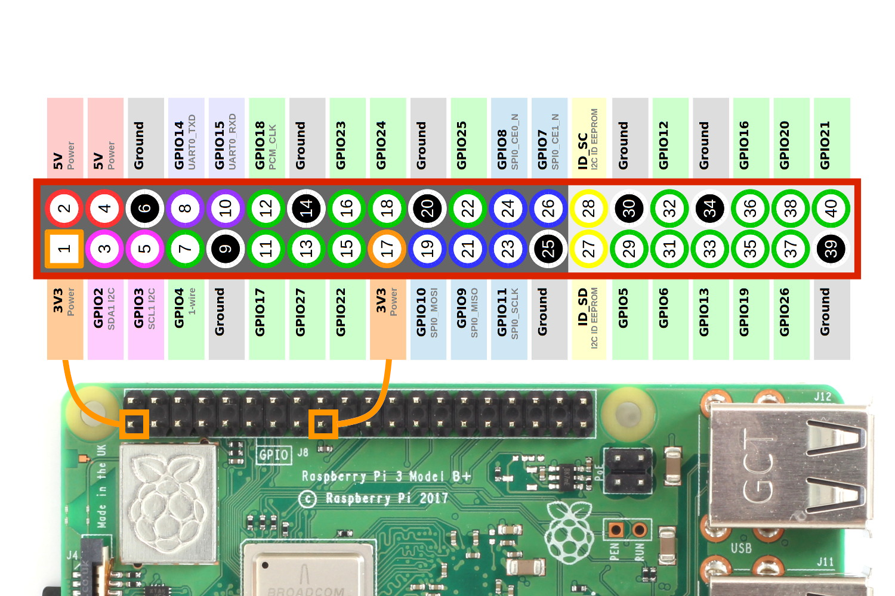
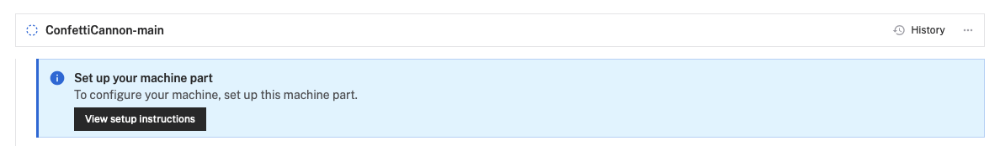
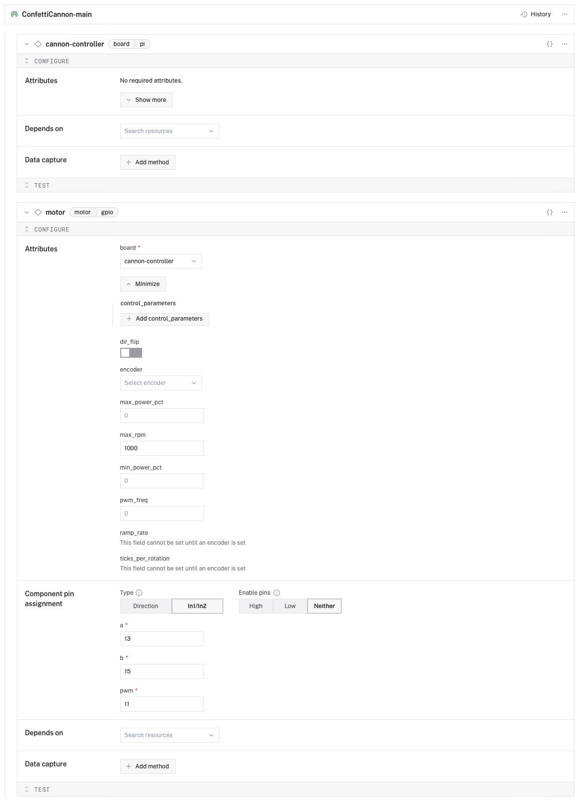

# Confetti Cannon

This repo has all the materials for the Confetti Cannon demo for using Pieces.

The confetti cannon is built around a Raspberry Pi with a 3D printed case, a motor, and spring-loaded confetti launchers. It is controlled by [Viam](https://www.viam.com), and the confetti is launched by code run locally another device.

This project is designed to show the snippet saving features of Pieces, and uses saved snippets for the code to fire the confetti cannon. The aim is to use this at an event, where an attendee will download Pieces, import a shared snippet, run this, launch confetti and win a prize!

## Hardware

The hardware you need is:

- [A Raspberry Pi 4 or higher](https://www.raspberrypi.com)
- A GPIO motor. We use this one: [Bemonoc 25GA370 DC Encoder Metal Gearmotor 12V](https://amzn.to/3yUJwUk)
- A [L298N Motor Driver](https://amzn.to/3yVtv0m)
- A 12v power supply, such as the [SoulBay 12V 1A AC Adapter](https://amzn.to/3XhhwDR)
- Jumper wires
- [Spring-loaded confetti launchers](https://amzn.to/4dGrCnu)
- A selection of M2.5 and M3 nuts and bolts

### Wiring

Use these diagrams for reference for the different pin connections.




Ensure both the 12v power supply and the Raspberry Pi are disconnected from power when wiring.

#### Power

1. Connect the __+ve__ terminal of the 12v supply to the __VS pin (pin 1)__ on the L298N motor driver.
1. Connect the __-ve__ terminal of the 12v supply to the __Gnd pin (pin 2)__ on the L298N motor driver.
1. Connect __pin 6__ on the Raspberry Pi (Ground) to the __Gnd pin (pin 2)__ on the L298N motor driver.

#### Motor control

1. Connect the __Out 1 pin__ (upper of the two 8 pins) on the L298N motor driver to the -ve connection on the motor. This is the __black__ wire from the connection block to the motor.
1. Connect the __Out 2 pin__ (lower of the two 8 pins) on the L298N motor driver to the +ve connection on the motor. This is the __red__ wire from the connection block to the motor.

#### L298N control

1. If there is a jumper connecting the __ENA pin__ (pin 4) on the L298N motor driver to  a __+5v pin__, remove it.
1. Connect the __ENA pin__ (pin 4) on the L298N motor driver to __pin 11__ (GPIO 17) on the Raspberry Pi.
1. Connect the __In1 & In2 pin__ (pin 5) on the L298N motor driver to __pin 13__ (GPIO 27) on the Raspberry Pi.
1. Connect the __In3 & In4 pin__ (pin 6) on the L298N motor driver to __pin 15__ (GPIO 22) on the Raspberry Pi.

## The case

The cannon is contained in a 3D printed case. You can find the STL files for this in the [`stl-files`](./stl-files/) folder.

| File               | Description |
| ------------------ | ----------- |
| main-frame.stl     | The main case that holds the Raspberry Pi and motor driver |
| cannon-gripper.stl | A component that attaches the motor to the confetti launcher |
| cannon-guide.stl   | A guide to hold the confetti launcher in place |
| cannon-offset.stl  | An offset to help put the guide in the right location |

### Assembly


## Software

For this project, you will need:

- A Viam project set up and configured with your hardware
- The Viam server installed on your Raspberry Pi
- Local code to control the Pi

### Set up the Pi

For the Raspberry Pi, you can use Raspberry Pi OS full or Lite. I recommend Lite as it is lighter weight and you don't need the desktop running. 

1. Set up Raspberry Pi OS Lite (64-bit) on your [SD card as normal](https://www.raspberrypi.com/software/). Make sure you have SSH access to the Pi configured in the Raspberry Pi installer configuration.
1. Put the SD card into the Pi, power it up, and connect over SSH.
1. Update the Pi software:

    ```bash
    sudo apt update && sudo apt full-upgrade --yes && sudo reboot
    ```

1. The Pi will reboot once done, so reconnect.


### Set up Viam

1. Create an account with [Viam](https://viam.com) and ensure you are logged in. You can use the free version for this project.
1. In the [Viam app](https://app.viam.com), create  a new machine and name it `ConfettiCannon`.

    

1. The empty machine will be created, and there will be a __View setup instructions__ button. Select this button to see the setup instructions.
1. Set the _Platform_ to `Linux /Aarch 64`, and the _Installation method_ to `viam-agent`.
1. A set of installation instructions will be provided with a command to run on the Pi. Run this command on the Pi.

    The command will look something like this, but will have your API Key ID, Key and part ID.

    ```bash
    sudo /bin/sh -c "VIAM_API_KEY_ID=<key id> VIAM_API_KEY=<key> VIAM_PART_ID=<part id>; \
      $(curl -fsSL https://storage.googleapis.com/packages.viam.com/apps/viam-agent/install.sh)"
    ```

1. Once run, the Pi will be configured and will run the Viam agent automatically, even after a reboot. The setup option will disappear from the machine page, and be replaced with an empty machine.
1. Select the __+__ next to the machine name in the side bar, then select _Component->board->pi_ if you are using a Raspberry Pi 4, or _Component->board->pi5_ if you are using a Raspberry Pi 5. Name the board `cannon-controller`
1. Select the __+__ next to the machine name in the side bar, then select _Component->motor->gpio_ to add the motor. Name it `motor`.
1. In the `motor` section set the following:

    1. Set the _board_ to `cannon-controller`
    1. Expand the _Show more_ section and set the *max_rpm* to `1000`.
    1. Set the _Component pin assignment_ to `In1/In2`. This refers to the connection on the motor driver.
    1. Set _a_ to `13`, _b_ to `15`, and _pwm_ to `11`. These are the positional values for the GPIO pins used on the Raspberry Pi. These are the positional numbers, not the GPIO pin numbers (for example, referring to the diagram above, the pin in position 11 is GPIO 27, so we set _pwm_ to 11).
1. Save the changes using the __Save__ button. The configuration will look like this:

    

1. To test the motor, expand the _Test_ section in the `motor` block, and use the __Forward__ and __Backward__ buttons to spin the motor.

## Control the Confetti Cannon

You can control the confetti cannon using code run from anywhere - the cannon is connected to Viam over the internet, so can be controlled from any internet connected device.